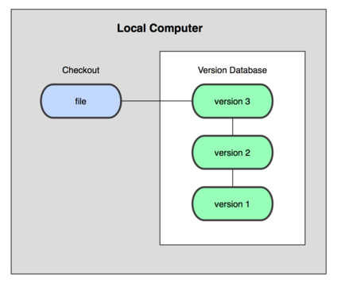
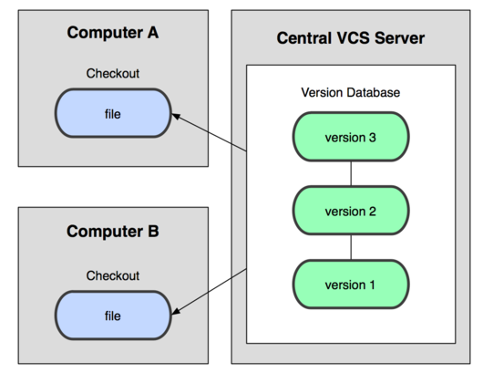
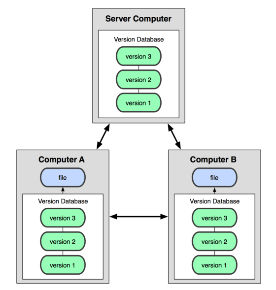

学习来源：

ProGit：https://gitee.com/progit/index.html

廖雪峰官方网站：https://www.liaoxuefeng.com/wiki/896043488029600

# 1. 起步

## 1.1 关于版本控制

版本控制：记录若干个文件内容变化，便于查阅特定版本修订情况的系统。

### 本地版本控制系统

采用简单的数据库记录文件的历次更新差异，最流行的是rcs，原理是保存并管理文件补丁（patch）。

文件补丁是一种特定格式的文本文件，记录着对应文件修订前后的内容变化。根据每次修订后的补丁，rcs 可以通过不断打补丁，计算出各个版本的文件内容。



### 集中化版本控制系统

（Centralized Version Control Systems：CVCS）

如CVS、SVN、Perforce，有一个集中管理的服务器，保存所有文件的修订版本，协同工作的人都通过客户端连到这台服务器，取出最新的文件或者提交更新。

好处：比本地的容易管理，可多人协同，管理员可掌控各开发者权限

缺点：中央服务器的单点故障，有丢失数据的风险；操作需要联网



### 分布式版本控制系统

（Distributed Version Control System：DVCS）

如Git、Mercurial、Bazaar、Darcs ，客户端不是提取最新版本的文件快照，而是把代码仓库完整地镜像下来。任何一处协同工作用的服务器发生故障，都可以用任何一个镜像出来的本地仓库恢复。



## 1.2 Git简史

1991年，Linus创建开源的Linux；

1991-2002年，Linux代码维护靠Linus手工合并；

2002-2005年，Linux社区启用分布式版本控制系统 BitKeeper维护代码；

2005年， BitKeeper免费使用权被收回，Linus用C写了分布式版本控制系统Git；

2008年，GitHub网站上线，无数开源项目开始迁移至GitHub。

## 1.3 Git基础

### 文件状态

任何一个文件，在 Git 内都只有三种状态：已提交（committed），已修改（modified）和已暂存（staged）。

已修改表示修改了某个文件，但还没有提交保存；（工作目录）

已暂存表示把已修改的文件放在下次提交时要保存的清单中；（暂存区域）

已提交表示该文件已经被安全地保存在本地数据库中了。（本地仓库）

### Git目录

每个项目都有一个 Git 目录，用来保存元数据和对象数据库的地方（重要！！！）

每次克隆镜像仓库，实际拷贝的就是这个目录里面的数据。

（如果 `git clone` 出来，就是其中 `.git` 的目录；如果 `git clone --bare` ，新建的目录本身就是 Git 目录）

## 1.4 安装Git

### 从源代码安装

版本最新（复杂，略）

### 安装包安装

#### Linux

- Fedora上用yum安装：yum install git-core

- Ubuntu(Debian体系）用apt-get安装：sudo apt-get install git

#### Mac

- 图形化安装工具：http://code.google.com/p/git-osx-installer

- 通过MacPorts (`http://www.macports.org`) 安装，安装后用下面的命令安装 Git：

```
$ sudo port install git-core +svn +doc +bash_completion +gitweb
```

- 直接从AppStore安装Xcode，Xcode集成了Git，默认没有安装，需要运行Xcode，选择菜单“Xcode”->“Preferences”，在弹出窗口中找到“Downloads”，选择“Command Line Tools”，点“Install”就完成安装了。

#### Windows

- https://git-scm.com/downloads （Git官网）

- https://gitforwindows.org/

  安装完成后，开始菜单找到Git-Git Bash，弹出命令行窗口即说明安装成功

## 1.5 初次运行Git前的配置


## 1.6 获取帮助


## 1.7 小结

