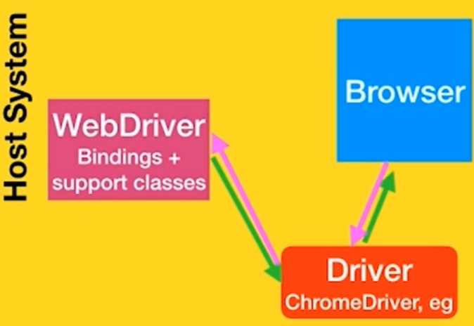
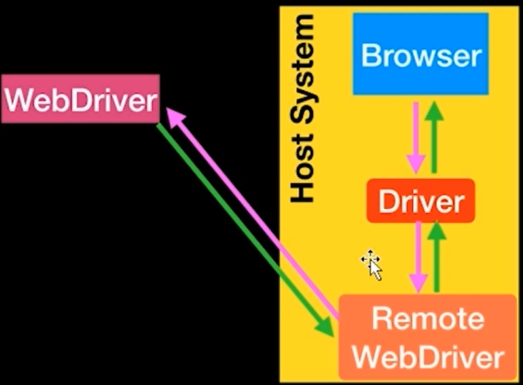
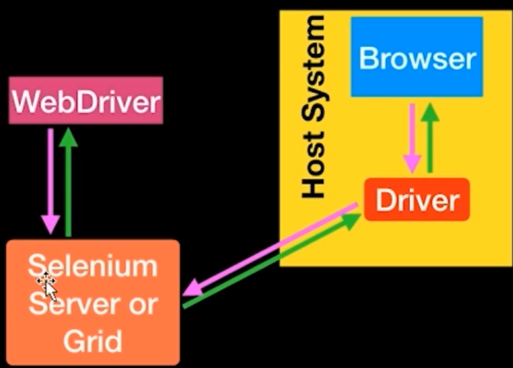
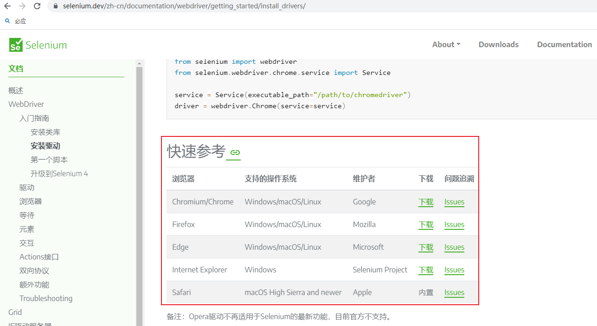
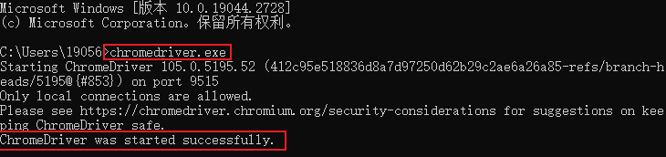
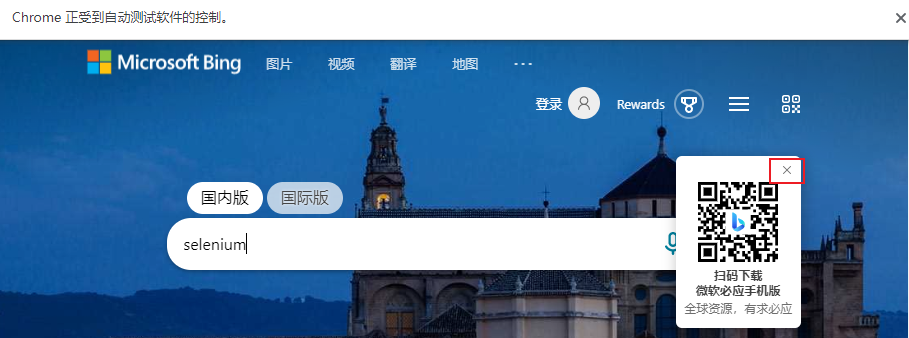

用于测试的网站：https://sahitest.com/demo/

# 03 Web自动化测试

## 测试相关概念

### 测试含义

- 运行程序，并发现程序的错误。

- 验证软件的正确性、完整性、安全性和质量的过程。

### 测试分类

#### 按开发阶段分

  1. 单元测试

     对模块的测试，对软件组成的单位进行测试

  2. 集成测试

     组装测试，程序的模块适当的组成策略组装在一起对程序的接口和集成后的功能进行测试

  3. 系统测试

     将软件系统看成整体进行测试，测试功能、性能、运行的软硬件环境进行测试

  4. 验收测试

     交付测试，项目部署前的最后测试。

#### 按是否查看代码分

  1. 黑盒测试
     功能测试

  2. 白盒测试 

     基于代码的测试

  3. 灰盒测试

     基于黑盒和白盒之间，既有功能测试，也有代码的测试，项目集成阶段，关注输入输出的正确性，同时关注性能、程序内部的正确性。

#### 按是否运行分

  1. 静态测试
  
     不运行程序本身，通过分析需求说明书、程序流程图、检测源码语法等做结构的分析。

2. 动态测试

   运行程序，检查运行结果与预期结果是否有差异，分析运行效率。

#### 按测试对象分

1. 性能测试
2. 安全测试
3. 兼容性测试
4. 文档测试
5. 用户体验测试
6. 业务测试
7. 界面测试
8. 安装测试
9. 内存泄漏测试

#### 按测试实施的组织分

1. α测试

   用户在开发环境下的测试，公司内部模拟用户实际操作的测试，测试软件功能、可用性、可靠性、性能等。

2. β测试

   验收测试，用户进入使用进行测试。

3. 第三方测试

   第三方机构测试

#### 按是否手工执行分

1. 手工测试

2. 自动化测试

#### 其他分类

1. 冒烟测试

   不同版本需求变更后，正式测试前对产品/系统进行简单的验收测试。

2. 回归测试

   修改旧代码后，可能引发新问题，需要测试是否对原有功能有影响。

## Web自动化测试的技术选型

选择标准：

- 发展趋势稳定上升

- 有活跃的社区供讨论

- 开源

- 支持主流的编程语言

- 支持主流浏览器（谷歌、IE、火狐等）

综上，考虑Python+Selenium。

## 适合自动化测试的项目

- 软件需求变动不频繁；
- 项目周期较长；
- 自动化测试脚本可重复使用。

# 04 Selenium三剑客：WebDriver、IDE、Grid

## Selenium

用于Web应用程序自动化测试工具，直接运行在浏览器中，像真正的用户在操作一样。

主要功能：

- 测试与浏览器的兼容性
- 测试系统功能：创建回归测试检验软件功能和用户需求  

特点：

- 开源、免费
- 多浏览器支持：Firefox、Chrome、IE、Opera、Edge
- 多平台支持：Linux、Windows、MAC
- 多语言支持：Java、Python、Ruby、C#、JavaScript、C++
- 支持分布式测试（使用Selenium Grid）
- 支持录制、回放和脚本生成（使用Selenium IDE）


Selenium三个项目：

## WebDriver

网络驱动器，是客户端API接口，测试人员调用这些接口，来访问浏览器驱动，浏览器驱动再访问浏览器。



与浏览器的通信也可以通过Selenium Server或RemoteWebDriver的远程通信。RemoteWebDriver与驱动程序和浏览器和同一系统上运行。



还可以使用Selenium Server或Selenium Grid进行分布式测试。



## IDE

Chrome或firefox等浏览器的插件，提供较完备的自动化功能，如脚本录制/回放、定时任务，可将录制的脚本导成不同编程语言的Selenium测试脚本。

## Grid

可以做分布式测试，在多台机器或异构环境中运行测试用例。

# 05 Selenium开发环境搭建

## 安装python

1. 官网下载，安装（勾选add to path）；

2. 高级系统设置-环境变量-系统变量中，path添加python安装路径和python安装路径下scripts路径（配置pip）；

3. 配置好环境变量后，在命令行中分别输入python和pip检测1和2是否安装成功。

## 安装selenium

pip install selenium

pip list查看已经安装好的模块

## 安装开发工具pycharm

https://www.jetbrains.com/pycharm/ 社区版

安装后要添加python解释器的路径（python安装路径）

快捷键操作：

Shift+F10：execute it or replace it with your code执行

Double Shift：search everywhere for classes, files, tool windows, actions, and settings搜索

Ctrl+F8：toggle the breakpoint切换断点

# 06 下载安装浏览器驱动

Selenium需要安装对应的浏览器驱动，才能驱动浏览器自动测试（版本匹配！！！）

下载安装驱动：

## 1. 检查浏览器版本

- 查看Chrome浏览器版本：①chrome://version/；②菜单栏--帮助--关于Google Chrome

- 查看Firefox浏览器版本：菜单栏Help--About Firefox

## 2. 下载对应版本驱动

- 打开Selenium官网 https://www.selenium.dev/ （切换为中文简体）

- 选择文档 Documentation https://www.selenium.dev/zh-cn/documentation/

- 找到浏览器驱动参考列表：WebDriver-入门指南-安装驱动-快速参考  https://www.selenium.dev/zh-cn/documentation/webdriver/getting_started/install_drivers/

  

- 下载和浏览器版本对应的浏览器驱动：https://chromedriver.storage.googleapis.com/index.html?path=105.0.5195.52/（以105.0.5195为例）

## 3. 设置驱动环境变量

把浏览器驱动的存放路径添加到系统变量path中：F:\Program Files\Selenium_driver

## 4. 测试驱动

命令行输入chromedriver.exe，检测是否成功安装



# 07 第一个Selenium测试

自动打开百度并搜索selenium：

（D:\PycharmProjects\07-01 Search_Baidu.py）

```
from selenium import webdriver	# 导入selenium下面的webdriver模块
from time import sleep
from selenium.webdriver.common.by import By

driver = webdriver.Chrome()		# 调用webdriver模块下的Chrome()类，赋值给driver，用于启动Chrome 
driver.get('http://www.baidu.com')	 # 通过driver变量，调用Chrome()类提供的get()方法访问百度首页
sleep(2)
# 通过id定位到输入框，输入搜索关键词selenium
driver.find_element(By.ID,'kw').send_keys('selenium')
sleep(2)
# 通过id定位到搜索按钮，操作点击
driver.find_element(By.ID,'su').click()
sleep(2)
```

自动打开必应，并搜索selenium（通过类封装代码更精炼）：

（D:\PycharmProjects\07-02 Search_Biying.py）

```
from selenium import webdriver
from time import sleep
from selenium.webdriver.common.by import By

class TestCase(object):
    def __init__(self):
        self.driver = webdriver.Chrome()
    def test(self):
        self.driver.get('https://cn.bing.com/')
        sleep(2)
        self.driver.find_element(By.ID, 'sb_form_q').send_keys('selenium')
        sleep(2)
        # 打开浏览器时自动显示了一个二维码图片，遮挡搜索按钮导致下一步点击无法继续，需要先点击二维码图片的×关掉
        self.driver.find_element(By.XPATH,'//*[@id="id_qrcode_popup_container"]/img[1]').click()
        sleep(2)
        self.driver.find_element(By.ID, 'search_icon').click()
        sleep(2)

if __name__ == '__main__':
    case = TestCase()
    case.test()
```



# 08 实现元素定位：Selenium八大定位方法

## 8种定位方法

### find_element(By.ID,'')		

通过元素ID属性定位元素

### find_element(By.NAME,'')		

通过元素NAME属性定位元素

### find_element(By.LINK_TEXT,'')		

专门用来定义文本链接，通过超链接标签中的文本内容定位元素

### find_element(By.PARTIAL_LINK_TEXT,'')		

通过超链接标签中的部分文本定位元素

### find_element(By.XPATH,'')		
通过xpath路径定位元素：

①使用绝对路径定位：标签名的层级关系来定位，从html一级级往下查找，同层级存在多个相同标签名时按顺序确定，如div[2]表示当前标签下第二个div标签；

②使用元素的属性值来定位（检查元素，右键Copy Xpath)：

`find_element(By.XPATH,"//input[@id='kw']")` ：//input表示当前页面某个input标签，不想指定标签名可用*代替，[@id='kw']表示元素的id值是kw，也可用name、class等定位，只要能唯一标识一个元素；

`③使用层级和属性结合定位`：若元素本身没有可以唯一标识的属性值，可以查找上一级元素:

`find_element(By.XPATH,"//span[@class='bg s_ipt_wr']/input")`："//span[@class='bg s_ipt_wr']通过class定位到父元素，后面/input查找子元素；

`④使用逻辑运算符`：and

find_element(By.XPATH,"//input[@id='kw' and @class='s_ipt']")

`⑤contains方法`：匹配一个属性中包含的字符串

`find_element(By.XPATH,"//span[contains(@class='s_ipt_wr')]/input")`：span标签的class属性为bg s_ipt_wr，contains方法只取了其中部分

`⑥text()方法`：匹配显示文本信息

find_element(By.XPATH,"//a[text(),'新闻']")

find_element(By.XPATH,"//a[contains(text(),'很长的’)']")：和contains结合使用实现partial link效果

### find_element(By.TAG_NAME,'')		
通过标签的名称定位（用得少，标签名称太多，一个标签往往定义一类功能，如`<input>`定义输入框、`<a>`定义超链接，因此用标签识别无法准确定位）

### find_element(By.CSS_SELECTOR,'')		
通过css选择器定位（检查元素，右键Copy selector)，常见语法：

.class：class选择器，find_element(By.CSS_SELECTOR,".s_ipt")表示选择class为s_ipt的元素

#id：id选择器，find_element(By.CSS_SELECTOR,"#kw")表示选择id为kw的元素

*：选择所有元素

element：如p表示选择所有`<p>`元素

element > element：如find_element(By.CSS_SELECTOR,"div > input")，选择父元素为`<div>`的所有`<input>`子元素

通过标签名定位不需要符号标识：find_element(By.CSS_SELECTOR,"input")表示选择标签名为input的元素

通过属性定位 [attribute=value]：find_element(By.CSS_SELECTOR,"[name='kw']")

组合定位：

find_element(By.CSS_SELECTOR,".form.fm > span > input.s_ipt")：查找的元素标签名为input，class属性为s_ipt，父元素标签名为span，父元素的父元素标签名为form且class属性为fm

更多定位用法：

find_element(By.CSS_SELECTOR,"[class*=s_ipt_wr]")：查找class属性包含s_ipt_wr字符串的元素

find_element(By.CSS_SELECTOR,"[class^=bg]")：查找class属性以bg开头的元素

find_element(By.CSS_SELECTOR,"[class$=wrap]")：查找class属性以wrap结尾的元素

find_element(By.CSS_SELECTOR,"form > input:nth-child(2)")：查找form标签下第2个input标签的元素

### find_element(By.CLASS_NAME,'')		
通过css类名定位
class中若出现空格，代表class属性中包含多个类名，只能使用其中一个，用唯一的类可准确定位；
确定类名唯一性：console中输入document.getElementsByClassName("")

## 定位方法示例

### 分别定义函数并测试搜索：

（D:\PycharmProjects\08-01 Element_Position.py）

```python
from selenium import webdriver
from time import sleep
from selenium.webdriver.common.by import By

class TestCase(object):
    def __init__(self):         # 初始化
        self.driver = webdriver.Chrome()
        self.driver.get('https://www.baidu.com/')
        self.driver.maximize_window()
        sleep(2)

    def test_id(self):          # 通过id属性定位
        element =self.driver.find_element(By.ID,'kw')
        element.send_keys('通过id定位')
        self.driver.find_element(By.ID,'su').click()
        sleep(2)

    def test_name(self):        # 通过name属性定位
        # find_element(By.NAME,'') 方法可能返回多个元素，返回第一个
        # find_elements(By.NAME,'') 返回一个集合
        self.driver.find_element(By.NAME,'wd').send_keys('通过name定位')
        self.driver.find_element(By.ID,'su').click()
        sleep(2)
        self.driver.quit()

    def test_link_text(self):       # 通过超链接标签的文本内容定位
        self.test_id()
        self.driver.find_element(By.LINK_TEXT,'百度首页').click()
        sleep(2)

    def test_partial_link_text(self):       # 通过超链接标签的部分文本内容定位
        self.test_id()
        self.driver.find_element(By.PARTIAL_LINK_TEXT,'首页').click()
        sleep(2)

    def test_xpath(self):       # 通过xpath路径定位（检查元素，右键Copy Xpath)
        self.driver.find_element(By.XPATH,'//*[@id="kw"]').send_keys('极客时间')
        self.driver.find_element(By.XPATH,'//*[@id="su"]').click()
        sleep(2)

    def test_tag(self):     # 通过标签的名称定位，用得少，标签名称太多无法准确定位
        self.driver.find_element(By.TAG_NAME,'input')

    def test_css_selector(self):        # 通过css选择器定位（检查元素，右键Copy selector)
        self.driver.find_element(By.CSS_SELECTOR,'#kw').send_keys('极客时间')
        self.driver.find_element(By.CSS_SELECTOR,'#su').click()
        sleep(2)

    def test_class_name(self):      # 通过css类名定位（class中若出现空格，代表class属性中包含多个类名，只能使用其中一个)
        self.driver.find_element(By.CLASS_NAME,'s_ipt').send_keys('极客时间')
        self.driver.find_element(By.CLASS_NAME,'s_btn').click()       #class="bg s_btn",定位时只能输入一个,确定类名唯一性：console中输入document.getElementsByClassName("bg")
        sleep(2)

if __name__== '__main__':
    case = TestCase()	# 以下分别对应使用不同定位方法执行
    # case.test_id()
    # case.test_name()
    # case.test_link_text()
    # case.test_partial_link_text()
    # case.test_xpath()
    # case.test_css_selector()
    # case.test_class_name()
```

### 定义公用方法，直接传参

（D:\PycharmProjects\08-02 util1.py）

```python
from selenium import webdriver
from time import sleep
from selenium.webdriver.common.by import By

# 工具类，一个公用方法，多种定位方式通用，只需传参即可
def get_element(driver,*loc):       # 加*代表多参数
    e = driver.find_element(*loc)
    return e

if __name__ == '__main__':
    driver = webdriver.Chrome()
    driver.get('https://www.baidu.com/')
    get_element(driver,By.ID,'kw').send_keys('极客时间')
    get_element(driver,By.ID,'su').click()
    sleep(2)
```

（D:\PycharmProjects\08-03 util2.py）

```python
from selenium import webdriver
from time import sleep
from selenium.webdriver.common.by import By

# 工具类，一个公用方法，多种定位方式通用，只需传参即可
def get_element(driver,*loc):       # 加*代表多参数，传入的参数为一个元组
    e = driver.find_element(*loc)
    return e

if __name__ == '__main__':
    driver = webdriver.Chrome()
    driver.get('https://www.baidu.com/')
    loc1 = (By.ID,'kw')     # 定义元组变量
    loc2 = (By.ID,'su')
    get_element(driver,*loc1).send_keys('极客时间')     # 这里加*代表解压参数列表
    get_element(driver,*loc2).click()
    sleep(2)

```

# 09  Selenium WebDriver工作原理

## WebDriver的工作原理

打车例子理解WebDriver的工作原理，打车时有三个角色：

- 乘客：他/她告诉出租车司机去哪里，大概怎么走
- 出租车司机：他按照乘客的要求来操控出租车
- 出租车：出租车按照司机的操控完成真正的行驶，把乘客送到目的地

Selenium WebDriver对应的角色：

- 工程师编写的自动化测试代码：自动化测试代码发送请求给浏览器的驱动（如火狐驱动、谷歌驱动）
- 浏览器的驱动：解析自动化测试代码，解析后把它们发送给浏览器
- 浏览器：执行浏览器驱动发来的指令，并最终完成工程师想要的操作

## Selenium Webdriver和浏览器的通信

- 对于每一条Selenium脚本，一个http请求会被创建并且发送给浏览器的驱动
- 浏览器驱动中包含了一个HTTP Server，用来接收这些http请求
- HTTP Server接收到请求后根据请求来具体操控对应的浏览器
- 浏览器执行具体的测试步骤
- 浏览器将步骤执行结果返回给HTTP Server
- HTTP Server又将结果返回给Selenium的脚本，如果是错误的http代码我们就会在控制台看到对应的报错信息


## WebDriver的协议

WebDriver使用的协议是：JSON Wire protocol

通信的数据格式是：JSON

驱动可以接受客户端不同语言（java、python等）的请求，是因为遵循公共的通信协议。

# 10 WebDriver核心方法和属性的使用

## 常用属性

- driver.name		浏览器名称
- driver.current_url		当前url
- driver.title		当前页面标题
- driver.page_source		当前页面源码
- driver.current_window_handle		窗口句柄
- driver.window_handles		当前窗口所有句柄

## 常用方法
- driver.set_window_size()		设置浏览器窗口大小

- driver.maximize_window()	窗口最大化

- driver.back()		浏览器后退

- driver.forward()			浏览器前进	

- driver.refresh()		浏览器刷新

- driver.close()		关闭当前窗口

- driver.quit()		退出浏览器

- driver.switch_to.frame() 		切换到frame

- driver.switch_to.alert		切换到alert

- driver.switch_to.active_element		切换到活动元素

## 实例演示

（D:\PycharmProjects\10 Webdriver_prop&method.py）

```python
from selenium import webdriver
from selenium.webdriver.common.by import By
from time import sleep
class TestCase(object):
    def __init__(self):
        self.driver = webdriver.Chrome()
        self.driver.get('http://www.baidu.com')
        self.driver.set_window_size(480,800)	# 设置浏览器窗口为移动端大小
        self.driver.maximize_window()

    def test_prop(self):        # driver常用属性
        print(self.driver.name)     # 获得浏览器名称
        print(self.driver.current_url)     # 获得当前url
        print(self.driver.title)    # 获得当前title
        print(self.driver.page_source)     # 获得当前页面源码
        print(self.driver.window_handles)      # 获得当前窗口所有句柄
        self.driver.quit()

    def test_method(self):        # driver常用方法
        self.driver.find_element(By.ID,'kw').send_keys('selenium')
        self.driver.find_element(By.ID,'su').click()
        sleep(2)
        self.driver.back()      # 后退
        sleep(2)
        self.driver.forward()       # 前进
        sleep(2)
        self.driver.refresh()       # 刷新
        sleep(2)
        self.driver.close()     # 关闭当前页面

    def test_windows(self):     # 窗口切换示例
        self.driver.find_element(By.LINK_TEXT,'新闻').click()
        windows = self.driver.window_handles

        while 1:
            for w in windows:
                self.driver.switch_to.window(w)
                sleep(2)

if __name__=='__main__':
    case = TestCase()
    # case.test_prop()
    # case.test_method()
    case.test_windows()
```

## 多窗口切换

current_window_handle：获得当前窗口句柄

window_handles：返回所有窗口的句柄到当前会话

switch_to.window()：切换到相应的窗口

```python
from time import sleep
from selenium import webdriver
from selenium.webdriver.common.by import By

driver = webdriver.Chrome()
driver.implicitly_wait(10)
driver.get('http://www.baidu.com')
driver.maximize_window()

# 获得百度搜索窗口句柄
search_windows = driver.current_window_handle

driver.find_element(By.LINK_TEXT, '登录').click()
driver.find_element(By.LINK_TEXT, '立即注册').click()

# 获得当前所有打开的窗口句柄
all_handles = driver.window_handles

for handle in all_handles:      # 当前打开百度首页和注册两个窗口
    if handle != search_windows:     # 遍历所有窗口，如果不在搜索首页，那么就在注册窗口
        driver.switch_to.window(handle)     # 切换到注册窗口
        print(driver.title)
        driver.find_element(By.NAME, 'userName').send_keys('username')
        driver.find_element(By.NAME, 'phone').send_keys('13719245661')
        sleep(2)
        driver.close()      # 关闭当前窗口

driver.switch_to.window(search_windows)     # 回到搜索窗口
print(driver.title)

driver.quit()
```

# 11 WebElement的常用属性和方法

## 常用属性

- id		标识

- size		宽高

- rect		宽高和坐标

- tag_name		标签名称

- text		文本内容

## 常用方法

- send_keys(value)		输入内容

- clear()		清空内容

- click()		单击

- submit() 		提交表单（模拟回车）

- get_attribute()		获得属性值（常用，重要！）

- is_selected()		是否被选中

- is_enabled()		是否可用

- is_displayed()		是否显示/可见

- value_of_css_property()		css属性值

## 实例演示

（D:\PycharmProjects\11 webelement_prop&method.py）

```python
from selenium import webdriver
from selenium.webdriver.common.by import By
from time import sleep
class TestCase(object):
    def __init__(self):
        self.driver = webdriver.Chrome()
        self.driver.get('https://sahitest.com/demo/linkTest.htm')

    def test_element_prop(self):        # 元素的常用属性
        e = self.driver.find_element(By.ID,'t1')
        print(type(e))      # 元素类型：element
        print(e.id)     # 元素标识
        print(e.tag_name)      # 元素标签名称
        print(e.size)       # 元素宽高
        print(e.rect)       # 元素宽高和坐标
        print(e.text)       # 元素文本内容

    def test_element_method(self):       # 元素的常用方法
        e = self.driver.find_element(By.ID,'t1')
        e.send_keys('hello world')
        
        # get_attribute()很常用，重要
        print(e.get_attribute('type'))      # 获得元素的类型属性
        print(e.get_attribute('name'))      # 获得元素的名称属性
        print(e.get_attribute('value'))     # 获得元素的值属性

        print(e.value_of_css_property('font'))      # 获得元素的字体
        print(e.value_of_css_property('color'))     # 获得元素的颜色

    def test_method(self):      # 元素中也可以使用元素查找find_element
        form_element = self.driver.find_element(By.XPATH,'/html/body/form[1]')     # 先获得一个form表单元素
        form_element.find_element(By.ID,'t1').send_keys('hello world')      # 在表单元素中定位元素t1进行输入
        sleep(2)

if __name__ == '__main__':
    case = TestCase()
    # case.test_element_prop()
    # case.test_element_method()
    case.test_method()
```

# 12 掌握form表单操作

## form表单测试流程

1. 定位表单元素

2. 输入测试值

3. 判断表单元素属性（是否隐藏，是否可用等）

4. 获得表单元素属性（type、value、name等）

5. 提交表单进行验证

## 实例演示

本地新建一个html文件，创建form表单，设置输入用户名和密码提交后会弹窗（D:\PycharmProjects\12_forms.html）

加载本地html文件，测试form表单提交，和一些常用属性和方法（D:\PycharmProjects\12 form.py）

**本地文件加载：     'file:///'+本地文件所在路径+'/文件名'      拼接路径进行加载**

```python
from selenium import webdriver
from selenium.webdriver.common.by import By
import os
from time import sleep

class TestCase(object):
    def __init__(self):
        self.driver = webdriver.Chrome()
        path = os.path.dirname(os.path.abspath(__file__))  # os.path.abspath(__file__)表示当前文件所在的路径，用os.path.dirname()获取上级目录（文件所在文件夹路径）
        file_path = 'file:///' + path + '/12_forms.html'  # 当前本地文件的路径获取：'file:///'+本地文件所在路径+'/文件名'
        self.driver.get(file_path)  # 本地创建了一个html文件，上一步拼接处理后可加载到本地html文件

        print(path)
        print(file_path)

    def test_login(self):       # 测试form表单登录，及一些常用属性和方法
        username = self.driver.find_element(By.ID, 'username')
        username.send_keys('admin')
        password = self.driver.find_element(By.ID, 'pwd')
        password.send_keys('123')
        print(username.get_attribute('value'))      # 获取username元素的值
        print(password.get_attribute('value'))      # 获取password元素的值

        self.driver.find_element(By.ID,'submit').click()
        sleep(2)

        self.driver.switch_to.alert.accept()  # form表单文件中，输入用户名和密码提交后会弹窗，这一步进行确定关闭弹窗
        sleep(2)

        # 清除输入的用户名和密码
        username.clear()
        password.clear()
        sleep(2)

if __name__ == '__main__':
    case = TestCase()
    case.test_login()
```

# 13 checkbox和radiobutton定位技巧

checkbox：多选框

radiobutton：单选

判断是否选中：is_selected()

选中：click()

```python
from selenium import webdriver
from time import sleep
import os
from selenium.webdriver.common.by import By

class TestCase(object):
    def __init__(self):
        self.driver = webdriver.Chrome()
        path = os.path.dirname(os.path.abspath(__file__))   # 获取html文件所在文件夹
        file_path = 'file:///'+path+'/13 forms_2.html'      # 获取html文件路径
        self.driver.get(file_path)

    def test_checkbox(self):
        read = self.driver.find_element(By.NAME,'reading')
        if not read.is_selected():      # is_selected() 属性判断，判断是否选中
            read.click()                # click()代表选中
        write = self.driver.find_element(By.NAME,'writing')
        if not write.is_selected():
            write.click()
        sleep(2)
        read.click()        # 再次点击，反选
        sleep(2)

    def test_radiobutton(self):
        lst = self.driver.find_elements(By.NAME,'gender')   # name属性相同，存在多个值
        lst[1].click()      # 选中数组中第2个选项

        self.driver.find_element(By.ID,'submit').click()
        sleep(2)
        self.driver.switch_to.alert.accept()
        sleep(2)

if __name__ == '__main__':
    case = TestCase()
    # case.test_checkbox()
    case.test_radiobutton()
```

# 14 使用Select类实现下拉列表定位

WebDriver提供Select类处理下拉框。

```python
from time import sleep
from selenium import webdriver
from selenium.webdriver.common.by import By
from selenium.webdriver.support.select import Select

driver = webdriver.Chrome()
driver.get('http://www.baidu.com')
driver.maximize_window()

# 打开百度的设置--搜索设置
driver.find_element(By.ID, 's-usersetting-top').click()
driver.find_element(By.LINK_TEXT, '搜索设置').click()
sleep(2)

sel = driver.find_element(By.XPATH, "//select[@id='nr']")
Select(sel).select_by_value('20')       # 通过value值定位下拉选项
Select(sel).select_by_index(0)          # 通过索引定位下拉选项
Select(sel).select_by_visible_text('每页50条')     # 通过文本内容定位下拉选项
sleep(2)

driver.quit()
```

## 常用方法

- select_by_value()		根据值选择
- select_by_index()		根据索引选择，第一个选项为0
- select_by_visible_text()		根据文本选择
- deselect_by_value()		根据值反选
- deselect_by_index()		根据索引反选
- deselect_by_visible _text()		根据文本反选
- deselect_all()		反选所有
- options()		所有选项
- all_selected_options()		所有选中选项
- first_selected_option()		第一个选择选项

##  实例一：单选，根据值、索引、文本选择

```python
from selenium import webdriver
from time import sleep
import os
from selenium.webdriver.common.by import By
from selenium.webdriver.support.select import Select

class TestCase(object):
    def __init__(self):
        self.driver = webdriver.Chrome()
        path = os.path.dirname(os.path.abspath(__file__))
        file_path = 'file:///'+path+'/14-01 forms_3.html'
        self.driver.get(file_path)
        sleep(3)

    def test_select(self):
        se = self.driver.find_element(By.ID,'province')
        se2 = Select(se)        # 实例化，Select需要传一个Webelement元素
        se2.select_by_index(2)  # 通过索引选择第3个选项
        sleep(2)
        se2.select_by_value('GD') # 通过值选择
        sleep(2)
        se2.select_by_visible_text('北京')    # 通过文本选择
        sleep(2)
        self.driver.quit()

if __name__ == '__main__':
    case = TestCase()
    case.test_select()
```

## 实例二：多选，根据索引选择，输出选项

```python
from selenium import webdriver
from time import sleep
import os
from selenium.webdriver.common.by import By
from selenium.webdriver.support.select import Select

class TestCase(object):
    def __init__(self):
        self.driver = webdriver.Chrome()
        path = os.path.dirname(os.path.abspath(__file__))
        file_path = 'file:///'+path+'/14-02 forms_3.html'       # 测试下拉列表多选
        self.driver.get(file_path)
        sleep(3)

    def test_select(self):
        se = self.driver.find_element(By.ID,'province')
        se2 = Select(se)        # 实例化，Select需要传一个Webelement元素

        for i in range(3):		# 全选
            se2.select_by_index(i)

        for option in se2.all_selected_options:
            print(option.text)     # 输出所有选中的选项

        print(se2.first_selected_option.text)       # 输出第一个选中的选项

        se2.deselect_all()      # 反选全部选项
        sleep(1)

        for option in se2.options:      # 输出所有选项
            print(option.text)

        self.driver.quit()

if __name__ == '__main__':
    case = TestCase()
    case.test_select()
```

# 15 弹框处理：alert、confirm、prompt

在WebDriver中处理JS生成的alert、confirm、prompt：

使用switch_to.alert()方法定位，再使用text、accept、dismiss、send_keys等操作。

## 常见弹框

- alert：提示
- confirm：确认（确定/取消）
- prompt：提示用户输入数据
## 常用方法/属性

- accept()：接受
- dismiss()：取消
- text：返回显示的文本信息
- send_keys：在警告框中输入内容

## 实例演示

```python
from selenium import webdriver
from time import sleep
import os
from selenium.webdriver.common.by import By
class TestCase(object):
    def __init__(self):
        self.driver = webdriver.Chrome()
        path = os.path.dirname(os.path.abspath(__file__))   # 获取当前脚本所在文件夹路径
        file_path = 'file:///'+path+'/15 form_alert.html'   # 获取要访问的本地html文件路径
        self.driver.get(file_path)

    def test_alert(self):
        self.driver.find_element(By.ID,'alert').click()
        alert = self.driver.switch_to.alert         # 切换到alert
        print(alert.text)
        sleep(2)
        alert.accept()

    def test_confirm(self):
        self.driver.find_element(By.ID,'confirm').click()
        confirm = self.driver.switch_to.alert
        print(confirm.text)
        sleep(2)
        confirm.dismiss()       # 取消，接受：confirm.accept()

    def test_prompt(self):
        self.driver.find_element(By.ID,'prompt').click()
        sleep(2)
        prompt = self.driver.switch_to.alert
        print(prompt.text)
        prompt.accept()
        sleep(5)

if __name__ == '__main__':
    case = TestCase()
    #case.test_alert()
    #case.test_confirm()
    case.test_prompt()

    case.driver.quit()
```

```python
from time import sleep
from selenium import webdriver
from selenium.webdriver.common.by import By

driver = webdriver.Chrome()
driver.get('http://www.baidu.com')
driver.maximize_window()

# 打开百度的设置--搜索设置
driver.find_element(By.ID, 's-usersetting-top').click()
driver.find_element(By.LINK_TEXT, '搜索设置').click()
sleep(2)
# 保存设置，出现弹窗
driver.find_element(By.CLASS_NAME, 'prefpanelgo').click()
alert = driver.switch_to.alert
print(alert.text)   # 获取弹窗文本
alert.accept()      # 弹窗确认
sleep(2)

driver.quit()
```

# 16 Selenium三种等待方式

## time.sleep

```python
import time
sleep(5)
```

固定等待

python自带模块time的sleep方法，导入time包即可使用；

可自定义等待时间，按预设的时间一直等待。

用于脚本调试，实际项目中不使用，会延长整个项目的自动化时间。

## implicitly_wait

```driver.implicitly_wait(5)
driver.implicitly_wait(5)
```

隐式等待

webdriver提供的方法，设置一个最长等待时间，在WebDriver对象实例的整个生命周期起作用，不针对某个元素，而是全局元素等待，即在定位元素时，需等页面全部元素加载完成，才执行下一步，若超出设置时间则抛出异常。对整个driver周期起作用，最开始设置一次即可。

缺点：JavaScript一般放在body最后进行加载，若页面某些js无法加载，但实际页面上的元素都已加载完毕，还会继续等待，直到页面加载结束（浏览器标签左上角圈圈不再转）才执行下一句，某些情况下会影响脚本执行速度。

## WebDriverWait

显式等待

类WebDriver提供的等待方法，需通过```from selenium.webdriver.support.wait import WebDriverWait```导入模块，等待某个条件成立则继续执行，否则在达到最大时长时抛出超时异常（TimeoutException）。

```
from selenium.webdriver.support.wait import WebDriverWait
WebDriverWait(driver, timeout, poll_frequency=0.5, ignored_exceptions=None)
```

在设置时间内，默认每隔一段时间检测一次当前页面元素是否存在，如果超过设置时间仍检测不到，则抛出异常。

driver：浏览器驱动

timeout：最长超时时间，默认秒为单位

poll_frequency：检测的间隔时间（步长），默认0.5秒

ignored_exceptions：超时后的异常信息，默认情况下抛出NoSuchElementException异常

## 实例演示

```
from selenium import webdriver
from selenium.webdriver.common.by import By
from time import sleep
from selenium.webdriver.support.wait import WebDriverWait
from selenium.webdriver.support import expected_conditions as EC

class TestCase():
    def __init__(self):
        self.driver = webdriver.Chrome()
        self.driver.get('http://baidu.com')

    def test_sleep(self):
        self.driver.find_element(By.ID,'kw').send_keys('selenium')
        sleep(3)    # 固定的等待时长
        self.driver.find_element(By.ID,'su').click()
        sleep(3)
        self.driver.quit()

    def test_implicitly(self):
        # 设置隐式等待10s，并非固定等待时间，脚本执行到某个元素定位时若元素存在则继续执行，定位不到时以轮询方式不断判断元素是否存在直到超出设置的10s后抛出异常
        self.driver.implicitly_wait(10)

        self.driver.find_element(By.ID,'kw').send_keys('selenium')
        self.driver.find_element(By.ID,'su').click()
        self.driver.quit()

    def test_WebDriverWait(self):
        wait = WebDriverWait(self.driver,3)     # 最长超时时间为3s
        wait.until(EC.title_is('百度一下，你就知道'))

        self.driver.find_element(By.ID, 'kw').send_keys('selenium')
        self.driver.find_element(By.ID, 'su').click()
        self.driver.quit()

if __name__ == "__main__":
    case = TestCase()
    case.test_WebDriverWait()
```

## 显式等待判断条件

### 和until()或until_not()结合使用

在设置时间内，等待后面的条件发生，等待期间，每隔一定时间（默认0.5s）调用until或until_not里的方法，直到返回True或False

```
WebDriverWait(driver,10).until(method,message="")
```

### 和expected_conditions结合使用

```
from selenium.webdriver.support import expected_conditions as EC
from selenium.webdriver.common.by import By

wait = WebDriverWait(diver,10,0.5)
element = wait.until(EC.presence_of_element_located((By.ID,'kw')),message='')
```

presence_of_element_located类中__init__()方法取的是2个参数(self, locator)，其中locator调用的是一个tuple（元组，该元组(By.ID,“su”)作为一个整体，对应相当于1个参数，加上类实例化代表自身的self参数，正好就是2个参数
因此，执行代码正确的写法为：presence_of_element_located((By.ID,“su”))，即需要嵌套两层英文圆括号。


**expected_conditions类提供的预期条件判断方法：**

| 方法                                   | 含义                                                            | 返回值     |
| -------------------------------------- | --------------------------------------------------------------- | ---------- |
| title_is                               | 当前页面标题是否等于预期                                        | 布尔       |
| title_contains                         | 当前页面标题是否包含预期字符串                                  | 布尔       |
| presence_of_element_located            | 元素是否被加在DOM树里，不代表元素一定可见                       | WebElement |
| visibility_of_element_located          | 元素是否可见，参数为定位                                        | WebElement |
| visibility_of                          | 元素是否可见，参数为定位后的元素                                | WebElement |
| presence_of_all_element_located        | 是否至少有一个元素存在于DOM树中                                 | 列表       |
| text_to_be_present_in_element          | 某个元素中的text是否包含预期字符串                              | 布尔       |
| text_to_be_present_in_element_value    | 某个元素的value属性是否包含预期字符串                           | 布尔       |
| frame_to_be_available_and_switch_to_it | 表单是否可以切换进去，若可以，返回True并切换进去，否则返回False | 布尔       |
| invisibility_of_element_located        | 某个元素是否不在DOM树中或不可见                                 | 布尔       |
| element_to_be_clickable                | 某个元素是否可见并且可点击                                      | 布尔       |
| staleness_of                           | 等到一个元素从DOM树中移除                                       | 布尔       |
| element_to_be_selected                 | 某个元素是否被选中，一般用在下拉列表中                          | 布尔       |
| element_selection_state_to_be          | 某个元素的选中状态是否符合预期，接收的参数是定位后的元素        | 布尔       |
| element_located_selection_state_to_be  | 某个元素的选中状态是否符合预期，接收的参数是定位                | 布尔       |
| alert_is_present                       | 页面上是否存在alert                                             | alert      |

### 自定义等待条件

```
wait = WebDriverWait(driver,10,0.5)
wait.until(lambda driver:driver.find_element_by_id('kw'))
```

# 17 鼠标键盘操作

Selenium的鼠标相关操作封装在ActionChains类中，正确的使用方法是：

ActionChains(driver).click(btn).perform()

## 鼠标操作

常用方法：

- perform()：执行ActionChains类中存储的所有行为
- click(on_element=None)：单击鼠标左键
- context_click(on_element=None)：点击鼠标右键
- double_click(on_element=None)：双击鼠标左键
- click_and_hold(on_element=None)：点击鼠标左键，不松开
- drag_and_drop(source, target)：拖拽到某个元素然后松开
- drag_and_drop_by_offset(source, xoffset, yoffset)：拖拽到某个坐标然后松开
- move_by_offset(xoffset, yoffset)：鼠标从当前位置移动到某个坐标
- move_to_element(to_element)：鼠标悬停到某个元素，调用时需要指定元素
- move_to_element_with_offset(to_element, xoffset, yoffset)：移动到距某个元素（左上角坐标）多少距离的位置
- release(on_element=None)：在某个元素位置松开鼠标左键

```
from selenium import webdriver
from selenium.webdriver import ActionChains

driver=webdriver.Chrome()
driver.get('https://www.baidu.cn')

# 定位到要悬停的元素
above = driver.find_element(By.LINK_TEXT,'设置')
# 对定位到的元素执行鼠标悬停操作（调用ActionChains类，把浏览器驱动driver作为参数传入)
ActionChains(driver).move_to_element(above).perform()
```

## 键盘操作

使用键盘按键方法前需要先导入Keys类

```
from selenium.webdriver.common.keys import Keys
```

- key_down(value, element=None)：按下某个键盘上的键

- key_up(value, element=None)：松开某个键

- send_keys(*keys_to_send)：发送某个键到当前焦点的元素

- send_keys_to_element(element, *keys_to_send)：发送某个键到指定元素

- send_keys(Keys.BACK_SPACE)：删除键

- send_keys(Keys.SPACE)：空格键

- send_keys(Keys.TAB)：制表键

- send_keys(Keys.ESCAPE)：回退键

- send_keys(Keys.ENTER)：回车键

- send_keys(Keys.CONTROL,'a')：全选

- send_keys(Keys.CONTROL,'c')：复制

- send_keys(Keys.CONTROL,'x')：剪切

- send_keys(Keys.CONTROL,'v')：粘贴

- send_keys(Keys.F1)：键盘F1

## 实例演示

测试网站Sahi Tests：http://sahitest.com/demo/

```
from time import sleep
from selenium import webdriver
from selenium.webdriver import ActionChains, Keys
from selenium.webdriver.common.by import By


class TestCase():
    def __init__(self):
        self.driver = webdriver.Chrome()
        self.driver.maximize_window()

    def test_mouse(self):
        self.driver.get('https://sahitest.com/demo/clicks.htm')
        btn = self.driver.find_element(By.XPATH, '/html/body/form/input[2]')
        ActionChains(self.driver).double_click(btn).perform()       # 双击
        sleep(2)

        btn = self.driver.find_element(By.XPATH, '/html/body/form/input[3]')
        ActionChains(self.driver).click(btn).perform()      # 单击
        sleep(2)

        btn = self.driver.find_element(By.XPATH, '/html/body/form/input[4]')
        ActionChains(self.driver).context_click(btn).perform()      # 点击鼠标右键
        sleep(5)

    def test_keys(self):
        self.driver.get('http://baidu.com')
        kw = self.driver.find_element(By.ID, 'kw')
        kw.send_keys('selenium')
        kw.send_keys(Keys.CONTROL, 'a')     # 全选
        sleep(2)
        kw.send_keys(Keys.CONTROL, 'x')     # 剪切
        sleep(2)
        kw.send_keys(Keys.CONTROL, 'v')     # 粘贴
        sleep(2)
        e = self.driver.find_element(By.XPATH, '//*[@id="u"]/a[1]')
        ActionChains(self.driver).move_to_element(e).click(e).perform()
        e = self.driver.find_element(By.LINK_TEXT, '新闻')
        ActionChains(self.driver).move_to_element(e).click(e).perform()
        sleep(2)

if __name__ =='__main__':
    case = TestCase()
    case.test_mouse()
    case.test_keys()
```

##  获得验证信息

Web自动化测试中，用得多的验证信息如下，获得搜索前后的差异信息，可作为自动化测试的断言点：

- title：获取当前页面标题
- current_url：获取当前页面的url
- text：获取当前页面的文本信息

# 文件上传下载

## 文件上传

文件上传一般需要单击“上传”按钮打开本地Windows窗口，WebDriver无法操作Windows控件，一般通过以下两种方式上传文件：

* 普通上传：将本地文件路径作为一个值放在input标签中，通过form表单将值提交给服务器，input标签可以看作输入框，通过send_keys()指定本地文件路径的方式实现文件上传。因此需要先找到上传的input标签。

* 插件上传：基本Flash、JavaScript、Ajax等技术实现的上传

## 文件下载

WebDriver允许设置默认的文件下载路径。不同浏览器设置方式不同。

FireFox：

先通过FirefoxProfile()做一些设置（下载路径，文件类型等），再将所有设置选项作为firefox_file参数传递给FireFox浏览器。

```
import os
from selenium import webdriver
from selenium.webdriver.common.by import By

fp = webdriver.FirefoxProfile()     # 通过FirefoxProfile()做一些设置
fp.set_preference('browser.download.folderList', 2)     # 设置为0表示文件下载到浏览器默认的下载路径；设置为2表示文件下载到指定目录
fp.set_preference('browser.download.dir', os.getcwd())      # 指定文件下载路径，os.getcwd()获取当前文件所在位置
fp.set_preference('browser.helperApps.neverAsk.saveToDisk', "binary/octet-stream")      # 指定要下载的文件类型（Content-type值），binary/octet-stream表示二进制文件

driver = webdriver.Firefox(firefox_profile=fp)      # 调用FireFox类时将所有设置选项作为firefox_profile参数传递到FireFox浏览器，浏览器下载时会根据这些设置将文件下载到当前脚本目录下
driver.get('https://pypi.org/project/selenium/#files')
driver.find_element(By.PARTIAL_LINK_TEXT, 'selenium-3.141.0.tar.gz').click()
```

Chrome：

先通过ChromeOptions()做一些设置（下载路径，文件类型等），再将所有设置选项作为options参数传递给Chrome浏览器。

```
import os
from selenium import webdriver
from selenium.webdriver.common.by import By

options = webdriver.ChromeOptions()
prefs = {'profile.default_content_settings.popups': 0,      # 设置为0，表示禁止弹窗下载窗口
         'download.default_directory': os.getcwd()}
options.add_experimental_option('prefs', prefs)

driver = webdriver.Chrome(options=options)
driver.get('https://pypi.org/project/selenium/#files')
driver.find_element(By.PARTIAL_LINK_TEXT, 'selenium-4.15.2.tar.gz').click()

driver.quit()
```

# 操作Cookie

Cookie中的数据是以字典形式存放的，可以通过key-value形式向浏览器中添加Cookie。

WebDriver提供了操作Cookie相关方法，可以读取、添加和删除Cookie。

方法如下：

get_cookies()：获得所有Cookie

get_cookie(aaa)：返回字典中key为aaa的Cookie

add_cookie(cookie_dict)：添加Cookie（传入的是键值对）

delete_cookie(name, optionsString)：删除名为optionsString的Cookie

delete_all_cookies()：删除所有Cookie

```
import os
from selenium import webdriver
from selenium.webdriver.common.by import By

driver = webdriver.Chrome()
driver.get('http://www.baidu.com')
cookie = driver.get_cookies()       # 获取所有Cookie
print(cookie)

driver.add_cookie({'name': 'key-aaa', 'value': 'value-bbb'}) # 添加Cookie（字典形式）

for cookie in driver.get_cookies():
    print('%s->%s' % (cookie['name'], cookie['value']))

driver.quit()
```

# 19 JavaScript方法和技巧，掌握JavaScript操作滚动条

WebDriver两种方法执行JavaScript代码：

* execute_script：同步执行
* execute_async_script：异步执行

window.scrollTo(左边距，上边距)方法可以设置浏览器滚动条的位置

```
from time import sleep
from selenium import webdriver
from selenium.webdriver.common.by import By

class TestCase(object):
    def __init__(self):
        self.driver = webdriver.Chrome()
        self.driver.get('http://www.baidu.com')

    def test_js(self):
        self.driver.execute_script("alert('test')")     # 执行一个弹窗的JS
        sleep(2)
        self.driver.switch_to.alert.accept()

        js1 = 'return document.title'        # 返回当前标题的JS脚本
        title = self.driver.execute_script(js1)
        print(title)

        js2 = 'var q = document.getElementById(\"kw\"); q.style.border = \"2px solid red\";'   # 改变搜索框的颜色
        self.driver.execute_script(js2)
        sleep(2)

        self.driver.find_element(By.ID, 'kw').send_keys('selenium')
        self.driver.find_element(By.ID, 'su').click()
        sleep(5)
        js3 = 'window.scrollTo(0, document.body.scrollHeight);' 
        # 用window.scrollTo()方法，让滚动条移到最底部
        self.driver.execute_script(js3)
        sleep(3)

if __name__ == '__main__':
    case = TestCase()
    case.test_js()
```

JS还可以在页面的文本框中输入内容：

text = ''输入内容"

js = "document.getElementById('id').value= ' "+ text + " ' ;"	# 将输入内容和JS代码通过+拼接

driver.execute_script(js)

# 处理HTML5视频播放 

WebDriver支持在指定浏览器上测试HTML5，使用JS测试这些功能，可以在任意浏览器上测试HTML5.

大多数浏览器使用插件如Flash播放视频，但不同浏览器需要使用不同的插件，HTML5定义了一个新的元素`<video>`，指定一个标准的方式嵌入电影片段。

JavaScript内置对象arguments，arguments包含函数调用的参数数组，[0]表示取第一个对象；currentSrc返回当前音频/视频的url，若未设置音频/视频，则返回空字符串；load()、play()、pause()控制视频的加载、播放和暂停。

```
from time import sleep
from selenium import webdriver
from selenium.webdriver.common.by import By

driver = webdriver.Chrome()
driver.get('http://videojs.com/')

video = driver.find_element(By.ID, "preview-player_html5_api")

# 返回文件播放地址
url = driver.execute_script("return argument[0].currentSrc;", video)
print(url)

# 播放视频
print('start')
driver.execute_script("argument[0].play()", video)

# 播放15s
sleep(15)

# 暂停视频
print('stop')
driver.execute_script("argument[0].pause()", video)

driver.quit()
```

# 滑动解锁

滑动过程，滑块左边距渐大，定位到滑块并用鼠标左键按下，拖动一定步数来完成解锁。

```
from time import sleep
from selenium import webdriver
from selenium.webdriver.common.by import By
from selenium.webdriver import ActionChains
from selenium.common.exceptions import UnexpectedAlertPresentException

driver = webdriver.Chrome()
driver.get('https://www.helloweba.net/demo/2017/unlock/')
driver.implicitly_wait(10)
slider = driver.find_elements(By.CLASS_NAME, 'slide-to-unlock-handle')[0]       # 这里有多个同类名的元素，elements，返回列表

action = ActionChains(driver)
action.click_and_hold(slider).perform()     # 单击并按住鼠标左键

for index in range(20):
    try:
        action.move_by_offset(20, 0).perform()      # 移动鼠标
    except UnexpectedAlertPresentException:
        break

alert = driver.switch_to.alert
print(alert.text)
```

另一种方法，通过TouchActions类实现上下滑动选择日期：( 4.0+版本的selenium鼠标操作不用TouchActions, 还是要用ActionChains）

```
from time import sleep
from selenium import webdriver
from selenium.webdriver import TouchActions     # 4.0+版本的selenium鼠标操作不用TouchActions, 还是要用ActionChains
from selenium.webdriver.common.by import By

driver = webdriver.Chrome()
driver.get('https://www.jq22.com/yanshi4976')
sleep(2)

driver.switch_to.frame("iframe")
driver.find_element(By.ID, 'appDate').click()

ymd = driver.find_elements(By.CLASS_NAME, 'dw-ul')
print(ymd)
year = ymd[0]
month = ymd[1]
day = ymd[2]

action = webdriver.TouchActions(driver)
action.scroll_from_element(year, 0, 5).perform()
action.scroll_from_element(month, 0, 30).perform()
action.scroll_from_element(day, 0, 30).perform()
```

# 20 屏幕截图，按日期格式保存图片

WebDriver提供截图函数save_screenshot()

* save_screenshot(filename)：获取当前屏幕截图并保存为指定文件，filename指定保存路径或图片的文件名
* get_screenshot_as_base64()：获取当前屏幕截图base64编码字符串
* get_screenshot_as_file(filename)：获取当前屏幕截图，使用完整路径
* get_screenshot_as_png()：获取当前屏幕的二进制文件数据

```
from time import sleep, strftime, localtime, time
from selenium import webdriver
from selenium.webdriver.common.by import By
import os

class TestCase(object):
    def __init__(self):
        self.driver = webdriver.Chrome()
        self.driver.get('https://www.baidu.com')

    def test(self):
        self.driver.find_element(By.ID, 'kw').send_keys('selenium')
        self.driver.find_element(By.ID, 'su').click()
        sleep(2)

        # 直接保存截图
        self.driver.save_screenshot('shot1.png')
        sleep(2)

        # 按当前日期格式保存截图
        st = strftime('%Y-%m-%d-%H-%M-%S', localtime(time()))
        filename = st + '.png'
        self.driver.save_screenshot(filename)
        sleep(2)

        # 按当前日期格式保存截图，并保存在专门的目录下（这里是脚本同路径下的screenshot文件夹）
        path = os.path.abspath('screenshot')    # 获取文件夹绝对路径
        filepath = path + '/' + filename
        self.driver.get_screenshot_as_file(filepath)
        sleep(2)

if __name__ == '__main__':
    case = TestCase()
    case.test()
```

# 21 frame、iframe定位，frame切入切出

Web应用中经常遇到frame/iframe表单嵌套页面的应用，frame标签有：frameset、frame、iframe三种，frameset和普通标签无区别，不影响正常定位；

frame、iframe是内嵌页面，WebDriver只能在一个页面上对元素进行定位和识别，无法直接定位frame/iframe表单内嵌页面上的元素，需要通过switch_to.frame()方法将当前定位主体切换为frame/iframe表单的内嵌页面。

## frame操作方法

switch_to.frame(reference)：切换frame，reference是传入的参数，用来定位frame，可以传入id、name、index以及selenium的WebElement对象

switch_to.default_content()：返回主文档

switch_to.parent_frame()：返回父文档

## 实例演示

```
from time import sleep
from selenium import webdriver
from selenium.webdriver.common.by import By

driver = webdriver.Chrome()
driver.get('http://www.126.com')
sleep(2)

login_frame = driver.find_element(By.CSS_SELECTOR, 'iframe[id^=x-URS-iframe')
driver.switch_to.frame(login_frame)
driver.find_element(By.NAME, 'email').send_keys('username')
driver.find_element(By.NAME, 'password').send_keys('password')
driver.find_element(By.ID, 'dologin').click()
driver.switch_to.default_content()
sleep(5)
```

switch_to.frame()可以直接对表单的id属性或name属性传参，从而可以定位到元素的对象。

上例中，表单的id属性后半部分数字是随机变化的，在CSS定位方法中，用^=匹配id属性为以“x-URS-iframe”开头的元素。

最后，switch_to.default_content()回到最外层的页面。

```
from time import sleep
from selenium import webdriver
from selenium.webdriver.common.by import By

class TestCase(object):
    def __init__(self):
        self.driver = webdriver.Chrome()
        self.driver.get('https://sahitest.com/demo/framesTest.htm')

    def test(self):
        top = self.driver.find_element(By.NAME, 'top')
        self.driver.switch_to.frame(top)        # 切换进第一个frame
        self.driver.find_element(By.XPATH, '/html/body/table/tbody/tr/td[1]/a[1]').click()
        sleep(5)

        self.driver.switch_to.default_content()    # 切换回主文档
        second = self.driver.find_element(By.XPATH, '/html/frameset/frame[2]')  
        self.driver.switch_to.frame(second)     # 进入第二个frame
        self.driver.find_element(By.XPATH, '/html/body/table/tbody/tr/td[1]/a[2]').click()
        sleep(5)

if __name__ == '__main__':
    case = TestCase()
    case.test()
```

# 22 Selenium IDE安装
